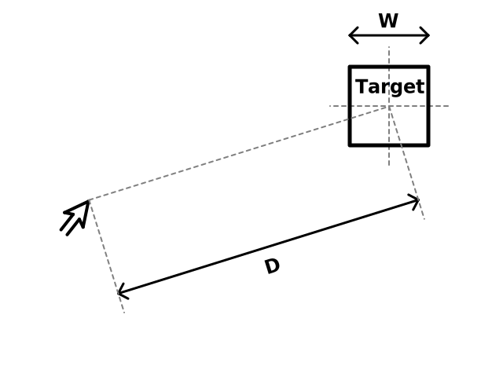

---
aliases:
- "费茨法则"
- "Fitts's Law"
name: "Fitts's Law"
zhname: "费茨法则"
tag:
- "费茨法则"
- "费茨"
---

# 费茨法则 (Fitts's Law)

- [英文维基百科](https://en.wikipedia.org/wiki/Fitts%27s_law)
- [中文维基百科](https://zh.wikipedia.org/wiki/%E8%B4%B9%E8%8C%A8%E6%B3%95%E5%88%99)

该法则指出，移动到目标区域所需的时间是到目标的距离除以目标宽度的函数。

*(图片来源：By Foobar628 at English Wikipedia, Creative Commons Attribution-Share Alike 3.0 Unported, https://en.wikipedia.org/wiki/Fitts%27s_law#/media/File:Fitts_Law.svg)*

费茨法则决定了在设计 UX 或 UI 时，交互元素应该尽可能大，而用户注意力区域和交互元素之间的距离应该尽可能小。这会对设计产生影响，例如将相近的任务进行归类分组等。

同时它还将“魔角 (Magic Corners)”这一概念正式化，即在角落放置关键的 UI 元素，从而使得用户可以通过移动鼠标轻松点击到。Windows 的开始按钮便位于魔角处便于选择，而有趣的是 MacOS 恰恰相反，它的“关闭窗口”按钮 _不处于_ 魔角处，从而能有效减小被误点击的概率。

参见：

- [The information capacity of the human motor system in controlling the amplitude of movement.](https://www.semanticscholar.org/paper/The-information-capacity-of-the-human-motor-system-Fitts/634c9fde5f1c411e4487658ac738dcf18d98ea8d)

