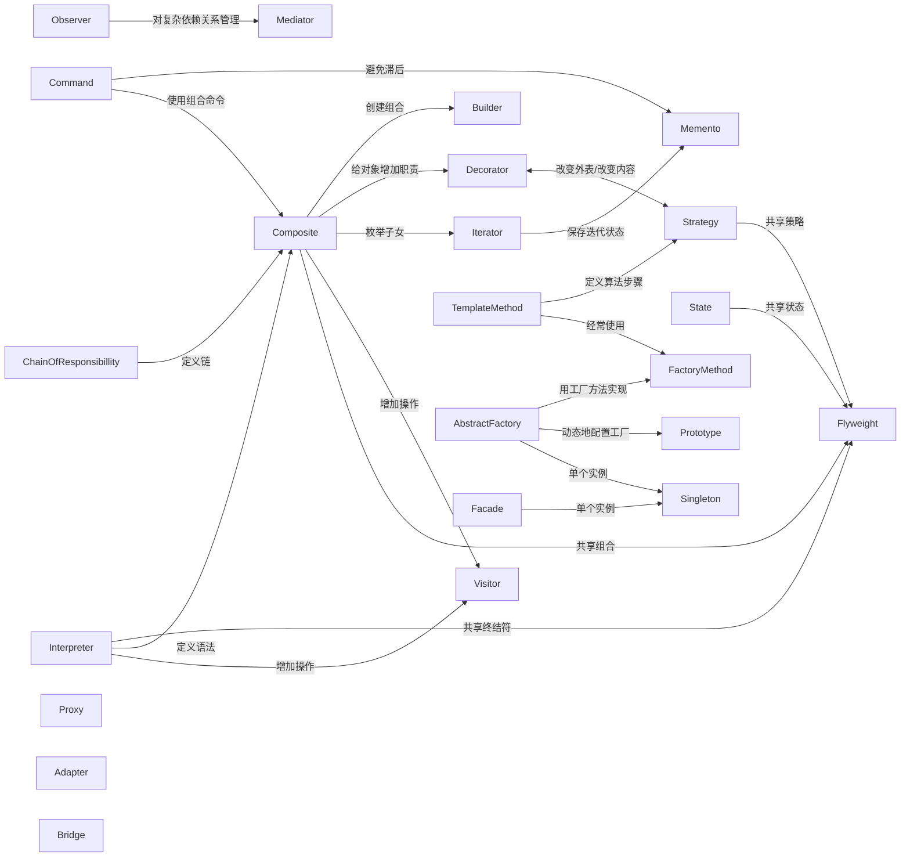

```dataview
table name,zhname,tags[0]
from "hacker-laws-zh/gof"
sort groups
```

| 划分类型 | 模式名称 | 描述 | 《设计模式》中提及 | 《代码大全》中提及 |
| --- | --- | --- | --- | --- |
| 创建型模式 | 抽象工厂模式 | 为一个产品族提供了统一的创建接口。当需要这个产品族的某一系列的时候，可以从抽象工厂中选出相应的系列创建一个具体的工厂类。 | 是 | 是 |
| 创建型模式 | 工厂方法模式 | 定义一个接口用于创建对象，但是让子类决定初始化哪个类。工厂方法把一个类的初始化下放到子类。 | 是 | 是 |
| 创建型模式 | 生成器模式 | 将一个复杂对象的构建与它的表示分离，使得同样的构建过程可以创建不同的表示。 | 是 | 否 |
| 创建型模式 | 惰性初始模式 | 推迟对象的创建、数据的计算等需要耗费较多资源的操作，只有在第一次访问的时候才执行。 | 否 | 否 |
| 创建型模式 | 对象池模式 | 通过回收利用对象避免获取和释放资源所需的昂贵成本。 | 否 | 否 |
| 创建型模式 | 原型模式 | 用原型实例指定创建对象的种类，并且通过拷贝这些原型,创建新的对象。 | 是 | 否 |
| 创建型模式 | 单例模式 | 确保一个类只有一个实例，并提供对该实例的全局访问。 | 是 | 是 |
| 创建型模式 | 多例模式 | 确保一个类只有命名的实例，并提供对这些实例的全局访问。 | 否 | 否 |
| 创建型模式 | 资源获取为初始化 | 通过绑定到合适对象的生命周期来确保资源被适当地释放。 | 否 | 否 |
| 结构型模式 | 适配器模式 | 将某个类的接口转换成客户端期望的另一个接口表示。适配器模式可以消除由于接口不匹配所造成的类兼容性问题。 | 是 | 是 |
| 结构型模式 | 桥接模式 | 将一个抽象与实现解耦，以便两者可以独立的变化。 | 是 | 是 |
| 结构型模式 | 组合模式 | 把多个对象组成树状结构来表示局部与整体，这样用户可以一样的对待单个对象和对象的组合。 | 是 | 是 |
| 结构型模式 | 修饰模式 | 向某个对象动态地添加更多的功能。修饰模式是除类继承外另一种扩展功能的方法。 | 是 | 是 |
| 结构型模式 | 外观模式 | 为子系统中的一组接口提供一个一致的界面， 外观模式定义了一个高层接口，这个接口使得这一子系统更加容易使用。 | 是 | 是 |
| 结构型模式 | 享元 | 通过共享以便有效的支持大量小颗粒对象。 | 是 | 否 |
| 结构型模式 | 代理 | 为其他对象提供一个代理以控制对这个对象的访问。 | 是 | 否 |
| 行为型模式 | 黑板 | 广义的观察者在系统范围内交流信息，允许多位读者和写者。 | 否 | 否 |
| 行为型模式 | 责任链 | 为解除请求的发送者和接收者之间耦合，而使多个对象都有机会处理这个请求。将这些对象连成一条链，并沿着这条链传递该请求，直到有一个对象处理它。 | 是 | 否 |
| 行为型模式 | 命令 | 将一个请求封装为一个对象，从而使你可用不同的请求对客户进行参数化；对请求排队或记录请求日志，以及支持可取消的操作。 | 是 | 否 |
| 行为型模式 | 解释器 | 给定一个语言, 定义它的文法的一种表示，并定义一个解释器, 该解释器使用该表示来解释语言中的句子。 | 是 | 否 |
| 行为型模式 | 迭代器 | 提供一种方法顺序访问一个聚合对象中各个元素, 而又不需暴露该对象的内部表示。 | 是 | 是 |
| 行为型模式 | 中介者 | 包装了一系列对象相互作用的方式，使得这些对象不必相互明显作用，从而使它们可以松散偶合。当某些对象之间的作用发生改变时，不会立即影响其他的一些对象之间的作用，保证这些作用可以彼此独立的变化。 | 是 | 否 |
| 行为型模式 | 备忘录 | 备忘录对象是一个用来存储另外一个对象内部状态的快照的对象。备忘录模式的用意是在不破坏封装的条件下，将一个对象的状态捉住，并外部化，存储起来，从而可以在将来合适的时候把这个对象还原到存储起来的状态。 | 是 | 否 |
| 行为型模式 | 空对象 | 通过提供默认对象来避免空引用。 | 否 | 是 |
| 行为型模式 | 观察者模式 | 在对象间定义一个一对多的联系性，由此当一个对象改变了状态，所有其他相关的对象会被通知并且自动刷新。 | 是 | 是 |
| 行为型模式 | 规格 | 以布尔形式表示的可重绑定的商业逻辑。 | 否 | 否 |
| 行为型模式 | 状态 | 让一个对象在其内部状态改变的时候，其行为也随之改变。状态模式需要对每一个系统可能取得的状态创立一个状态类的子类。当系统的状态变化时，系统便改变所选的子类。 | 是 | 否 |
| 行为型模式 | 策略 | 定义一个算法的系列，将其各个分装，并且使他们有交互性。策略模式使得算法在用户使用的时候能独立的改变。 | 是 | 是 |
| 行为型模式 | 模板方法 | 模板方法模式准备一个抽象类，将部分逻辑以具体方法及具体构造子类的形式实现，然后声明一些抽象方法来迫使子类实现剩余的逻辑。不同的子类可以以不同的方式实现这些抽象方法，从而对剩余的逻辑有不同的实现。先构建一个顶级逻辑框架，而将逻辑的细节留给具体的子类去实现。 | 是 | 是 |
| 行为型模式 | 访问者 | 封装一些施加于某种数据结构元素之上的操作。一旦这些操作需要修改，接受这个操作的数据结构可以保持不变。访问者模式适用于数据结构相对未定的系统，它把数据结构和作用于结构上的操作之间的耦合解脱开，使得操作集合可以相对自由的演化。 | 是 | 否 |
| 并发型模式 | 主动对象 |  | 否 | 否 |
| 并发型模式 | 阻碍 |  | 否 | 否 |
| 并发型模式 | 双重检查锁定 |  | 否 | 否 |
| 并发型模式 | 守卫 |  | 否 | 否 |
| 并发型模式 | 领导者/追随者 |  | 否 | 否 |
| 并发型模式 | 监测对象模式 |  | 否 | 否 |
| 并发型模式 | 读写锁 |  | 否 | 否 |
| 并发型模式 | 调度 |  | 否 | 否 |
| 并发型模式 | 线程池模式 |  | 否 | 否 |
| 并发型模式 | 线程特定存储 |  | 否 | 否 |
| 并发型模式 | 反应器 |  | 否 | 否 |

**参考文献**
* [设计模式 (计算机) - 维基百科，自由的百科全书](https://zh.wikipedia.org/zh-hans/%E8%AE%BE%E8%AE%A1%E6%A8%A1%E5%BC%8F_(%E8%AE%A1%E7%AE%97%E6%9C%BA))