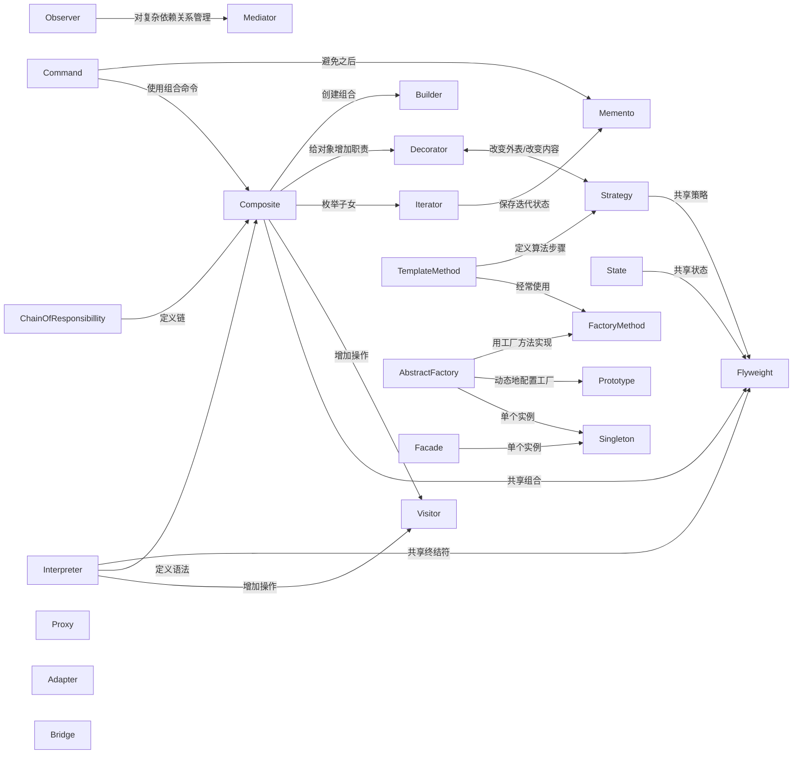

```mermaid
flowchart LR
    Composite -- 创建组合 --> Builder
    Composite -- 给对象增加职责 --> Decorator
    Composite -- 枚举子女 --> Iterator
    Composite -- 增加操作 --> Visitor
    Composite -- 共享组合 --> Flyweight
    Iterator -- 保存迭代状态 --> Memento
    Strategy -- 共享策略 --> Flyweight
    State -- 共享状态 --> Flyweight
    Interpreter -- 共享终结符 --> Flyweight
    Interpreter -- 定义语法 --> Composite
    Interpreter -- 增加操作 --> Visitor
    ChainOfResponsibillity -- 定义链 --> Composite
    Command -- 避免之后 --> Memento
    Command -- 使用组合命令 --> Composite
    Decorator <--改变外表/改变内容 --> Strategy
    TemplateMethod -- 定义算法步骤 --> Strategy
    TemplateMethod -- 经常使用 --> FactoryMethod
    AbstractFactory -- 用工厂方法实现 --> FactoryMethod
    AbstractFactory -- 动态地配置工厂 --> Prototype
    AbstractFactory -- 单个实例 --> Singleton
    Facade -- 单个实例 --> Singleton
    Observer -- 对复杂依赖关系管理 --> Mediator
    Proxy
    Adapter
    Bridge
```
